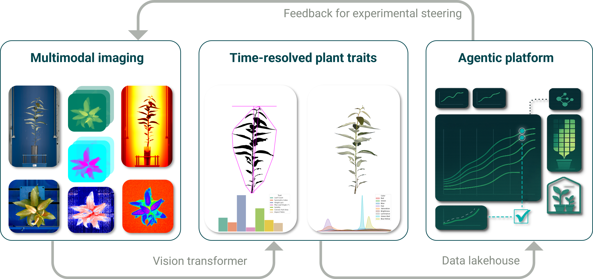

  

# 01/29/2026 &mdash; AotW#1: OPAL &mdash;  Plant Phenotyping Analysis Agent 

---

## Science Story

The Advanced Plant Phenotyping Laboratory (APPL) at Oak Ridge National Laboratory is a one-of-a-kind robotic greenhouse that operates 24/7, imaging plants on daily or weekly schedules to study the genetics driving plant functioning. This automated facility generates massive volumes of images and associated plant trait data that, until now, could take months or even years to analyze and translate into biologically meaningful insights. The Orchestrated Platform for Autonomous Laboratories (OPAL), is a cross-laboratory DOE project under the umbrella of the Genesis Mission that pairs artificial intelligence systems and high-performance computing with facilities like APPL to accelerate scientific discovery in plant science and beyond.

  

  

---

## Agentic Motivation

APPL was originally developed as a passive imaging system: it would collect data, but deriving insights required extensive manual analysis over months. Transforming this workflow into a multi-agent system provides several key benefits:

- **Conversational experiment interaction.** Through a chat interface, scientists describe their experiment and analysis goals in natural language (e.g., "show me my five tallest and five shortest plants between April 15th and April 30th"). The agent interprets the request, clarifies intent through dialogue, and orchestrates the full analysis pipeline autonomously.
- **Coordinated multi-agent execution.** A user request triggers a cascade of specialized compute agents, each with defined roles and tasks, that work together to retrieve data, run analyses, and compile results &mdash; replacing what was previously a long chain of manual steps.
- **On-demand HPC image analysis.** If any images from the requested experiment have not yet been analyzed, the system automatically dispatches them to the Frontier supercomputer for real-time feature extraction, ensuring that results are always up to date without requiring the scientist to manage the compute pipeline.
- **Integrated reporting with biological interpretation. The system produces a comprehensive report combining text summaries, annotated plant images, time-series trajectories, genotype breakdowns, and key biological interpretations contextualized by the stated goals of the experiment &mdash; including recommended next steps.

By converting APPL from a passive data collection facility into an interactive, steerable experiment, OPAL reduces the time from data acquisition to scientific insight from months to hours and is projected to at least double researcher productivity.

---

## Implementation

The technical architecture integrates a nightly offline workflow for large-scale data ingestion with an interactive online workflow for real-time biological analysis, all unified by a multi-agent framework. Each night, raw imagery is processed on the APPL analysis server and staged to Frontier, where vision transformer models generate hundreds of terabytes of segmentation masks and precomputed plant KPIs. The interactive layer utilizes the Academy agentic framework, where a Co-Pilot agent translates natural language queries into execution plans, which are then handed off to a Compute Agent on Frontier. This agent uses Parsl to manage high-performance compute jobs &mdash; either retrieving precomputed traits or triggering on-demand inference for new hypotheses &mdash; while S3M Streams provides a secure, cross-facility Redis substrate for communication between agents. The entire lifecycle, including LLM prompts and HPC execution, is monitored via Flowcept to ensure end-to-end provenance and auditability.

  

---

## To Know More

### Source Code
- **Repository:** https://code.ornl.gov/opal/agents
- **Documentation:** https://code.ornl.gov/opal/agents/-/blob/main/docs/README.md

### Additional Resources
- **Video/Presentation:** 
    - Short highlight: https://youtu.be/N15NIsSLbro
    - Long highlight: https://youtu.be/GTxENDA-DVw
- **Website:** https://opal-doe.org
- **Contact:** souzar@ornl.gov, rosendod@ornl.gov, lagergrenjh@ornl.gov

---

*Last Updated: 01/29/2026*  
*Contributed by: Renan Souza, Daniel Rosendo, John Largergren*
